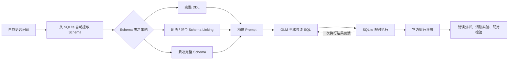

# LLM Text-to-SQL：Schema Linking、执行反馈与紧凑 Schema 评测

这是一个面向 SQLite 的大语言模型 Text-to-SQL 系统与实验项目。系统接收自然语言问题，自动读取数据库 Schema，调用智谱 `glm-4.5-air` 生成只读 SQL，执行查询，并使用 Spider Test Suite 与 BIRD Mini-Dev 官方评测逻辑验证结果。

项目重点不是训练一个新的大模型，而是研究：**不同 Schema 提供方式和执行反馈策略，能否在保证准确率的同时降低提示词成本。**

## 主要结论

1. 在30题开发集上，Top-4词法 Schema Linking 将 Spider Test Suite Accuracy 从56.67%提高到66.67%，tokens减少34.7%。
2. 但在150题内部扩展验证中，固定Top-4从31.33%降至23.33%，虽然tokens减少39.7%，准确率退化具有统计显著性（McNemar `p=0.0169`）。这说明开发集收益不能直接视为泛化能力。
3. 加入embedding没有超过纯词法方法；一次执行结果反馈也没有稳定改进准确率。
4. 不删除任何表和字段、只压缩表示形式的“紧凑完整 Schema”更稳健：
   - Spider 150题：31.33% → 30.67%，tokens减少11.67%，差异不显著（`p=1.0`）。
   - BIRD Mini-Dev 500题：44.80% → 44.00%，tokens减少11.04%，差异不显著（`p=0.6835`）。

因此，本项目最终支持的结论是：**激进选表具有较高的必要表召回风险；紧凑完整 Schema 能以较低风险减少输入成本，但不能声称提高准确率。**

## 系统流程



## 核心实验

| 数据与阶段 | 方法 | 官方主指标 | Tokens | 结论 |
|---|---|---:|---:|---|
| Spider开发集，30题 | 完整 Schema | 56.67% | 17,531 | Exp1基线 |
| Spider开发集，30题 | Top-4词法链接 | 66.67% | 11,443 | 开发集上提升 |
| Spider开发集，30题 | 词法+Embedding | 66.67% | 11,341 | 没有超过词法方法 |
| Spider开发集，30题 | 一次执行结果反馈 | 63.33% | 额外18,420 | 出现回归 |
| Spider内部扩展，150题 | 完整 Schema | 31.33% | 85,485 | 扩展基线 |
| Spider内部扩展，150题 | Top-4词法链接 | 23.33% | 51,543 | 显著退化 |
| Spider内部扩展，150题 | 紧凑完整 Schema | 30.67% | 75,508 | 准确率相当，tokens -11.67% |
| BIRD Mini-Dev，500题 | 完整 Schema | 44.80% | 420,203 | 跨基准基线 |
| BIRD Mini-Dev，500题 | 紧凑完整 Schema | 44.00% | 373,819 | 准确率相当，tokens -11.04% |

30题用于方法开发，不能作为最终泛化证据；150题来自公开 Spider `train_others`，作为项目内部扩展验证而非官方隐藏测试；BIRD Mini-Dev是公开开发集。项目没有声称达到SOTA。

## 目录结构

| 目录 | 内容 |
|---|---|
| `day1_minimal_demo` | 学生数据库上的问题→LLM→SQL→执行→判定最小闭环 |
| `day2_auto_schema` | 从SQLite自动提取Schema并动态构建Prompt |
| `day3_batch_baseline` | 10题批量调用、断点续跑和自动评测 |
| `day4_spider_subset` | 接入Spider并建立20题初始基线 |
| `day5_official_evaluation` | 接入Spider官方Test Suite评测器 |
| `day6_large_schema_experiment` | 冻结30题较大Schema开发集与完整Schema基线 |
| `day7_lexical_schema_linking` | 字符串、RapidFuzz与外键路径的启发式选表 |
| `day8_hybrid_schema_linking` | 融合智谱Embedding的混合选表 |
| `day9_execution_feedback` | 一次执行结果反馈与自校正实验 |
| `day10_heldout_evaluation` | 150题内部扩展验证和McNemar检验 |
| `day11_adaptive_schema_linking` | 动态选表与低置信度完整Schema回退审计 |
| `day12_compact_schema` | 不删表字段的紧凑完整Schema表示 |
| `day13_bird_minidev` | BIRD Mini-Dev 500题跨基准官方评测 |

## 技术栈

- Python 3.12、SQLite、SQL
- 智谱 `glm-4.5-air` 与 `embedding-3`
- Schema自动提取、外键图、RapidFuzz、Embedding相似度
- 只读SQL校验、查询超时、断点续跑、Token与延迟记录
- Spider Test Suite、BIRD Mini-Dev官方Execution Accuracy
- 消融实验、错误分析、McNemar双侧精确检验

## 快速开始

```powershell
cd "D:\SystemDir\Desktop\Research project\Text-to-SQL System"
python -m venv .venv
.\.venv\Scripts\python.exe -m pip install -r requirements.txt
```

需要调用模型时，在当前PowerShell窗口临时设置密钥：

```powershell
$secureApiKey = Read-Host "请输入 ZAI API Key" -AsSecureString
$env:ZAI_API_KEY = [System.Net.NetworkCredential]::new("", $secureApiKey).Password
$env:ZAI_MODEL = "glm-4.5-air"
```

完成后清除：

```powershell
Remove-Item Env:ZAI_API_KEY
Remove-Variable secureApiKey
```

各阶段的具体命令和数据准备要求见对应目录的 `README.md`。外部Spider、BIRD数据与虚拟环境不会提交到Git。

## 进一步阅读

- [完整项目报告](PROJECT_REPORT.md)
- [BIRD跨基准正式结果](day13_bird_minidev/README.md)
- [BIRD官方配对结果](day13_bird_minidev/bird_official_paired_comparison.json)

## 项目边界

- Schema Linking是可解释的启发式简化实现，不是论文级训练模型。
- API模型可能存在预训练数据污染，公开开发集结果不能等同于隐藏测试成绩。
- Execution Accuracy只验证查询结果，不保证生成SQL在所有数据库状态下语义等价；Spider Test Suite通过多个数据库实例缓解该问题。
- 实验记录保留失败结果，不根据最终成绩删除不利实验。

