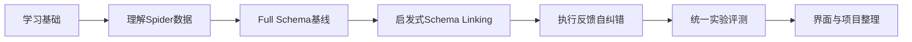

你现在正式进入第三项目开发，路线定为：

> **基于启发式模式链接与执行反馈的大模型Text-to-SQL系统实现与评测**

先学基础、再跑通baseline、然后逐步增加模块。总周期建议控制在3周左右。



## 第一阶段：基础学习，3天

暂时不要直接让AI生成整个项目。

### 第1天：理解大模型应用

学习并能口头解释：

- 大模型输入、输出和上下文
- Prompt是什么
- Zero-shot和Few-shot
- temperature作用
- token和上下文长度
- 为什么模型会编造表名和字段名
- API调用与本地模型的区别

完成一个最小实验：给模型一张简单学生表，让它根据自然语言生成SQL，手工检查结果。

### 第2天：复习SQL与数据库

重点复习：

- `SELECT、WHERE、ORDER BY`
- `GROUP BY、HAVING`
- 聚合函数
- 子查询
- 多表`JOIN`
- 主键、外键
- NULL处理

手工完成10～15道包含连接和聚合的SQL题。

### 第3天：理解Text-to-SQL

掌握：

- Text-to-SQL的输入输出
- Schema表示方式
- Schema Linking的作用
- Execution Accuracy
- 为什么同一问题可能有多种正确SQL
- 执行反馈能修复什么、不能修复什么

阶段验收：你能不看资料解释“自然语言问题如何经过系统变成可执行SQL”。

## 第二阶段：数据和工程准备，2天

第一版只使用：

> Spider经典版SQLite开发集子集

不要立即使用Spider 2.0和BIRD。

需要完成：

- 了解Spider的问题、数据库、Schema和标准SQL格式
- 选择8～12个数据库
- 选择约150～250个问题
- 覆盖简单、中等和少量困难问题
- 按数据库划分调试集和最终测试集
- 跑通官方或项目统一的执行评价程序

建议代码结构：

```
text2sql-project/
├── configs/
├── data/
├── src/
│   ├── database/
│   ├── llm/
│   ├── prompting/
│   ├── schema_linking/
│   ├── correction/
│   ├── evaluation/
│   └── safety/
├── experiments/
├── tests/
├── app/
└── README.md
```

所有API密钥只能放在本地环境变量中，不能提交到GitHub。

## 第三阶段：实现基础Baseline，3天

### Exp1：Full Schema直接生成

输入包括：

- 自然语言问题
- 完整表结构
- 主外键关系
- SQL生成要求

输出为SQL。

完成：

- 大模型接口封装
- Schema读取与序列化
- Prompt模板
- SQL代码块清理
- SQL解析
- 只读安全执行
- 执行结果保存

记录：

- 生成SQL
- 标准SQL
- 是否语法有效
- 是否执行成功
- 是否执行正确
- 响应时间
- token或调用成本
- 错误信息

阶段验收：不依赖界面，可以批量跑30～50道题并导出CSV。

## 第四阶段：实现Few-shot和Schema Linking，4天

### Exp2：Full Schema＋Few-shot

为模型提供少量SQL示例，研究是否改善：

- JOIN
- 聚合
- 子查询
- 排序与限制

示例不能直接泄露测试题答案。

### Exp3：启发式Schema Linking

只实现：

- 表名和字段名字符串匹配
- RapidFuzz模糊匹配
- Embedding余弦相似度
- 示例值匹配
- 外键关联表扩展

同时记录：

- 保留多少表和字段
- 是否保留标准SQL实际使用的表
- Schema压缩率
- 表召回率
- 字段召回率

不要训练专门的Schema Linking模型。

## 第五阶段：执行反馈自纠错，3天

### Exp4：Schema Linking＋执行反馈

流程：

1. 生成SQL。
2. 用SQL解析器进行安全检查。
3. 在只读SQLite中执行。
4. 捕获明确错误。
5. 将问题、Schema、原SQL和错误信息反馈给模型。
6. 最多修正两次。
7. 保存每一次修正记录。

允许反馈：

- SQL语法错误
- 表或字段不存在
- 类型错误
- 明确的数据库执行异常

不能因为结果为空就自动认定SQL错误；也不能把标准SQL或标准结果交给模型。

阶段验收：能够展示至少三个修正成功案例和三个修正失败案例。

## 第六阶段：统一实验，3天

固定：

- 同一个模型
- 相同temperature
- 相同数据划分
- 相同评价脚本
- 相同最大重试次数

比较：

- Exp1：Full Schema直接生成
- Exp2：Full Schema＋Few-shot
- Exp3：启发式Schema Linking
- Exp4：Schema Linking＋执行反馈

核心指标：

- SQL有效率
- 执行成功率
- Execution Accuracy
- 首次生成准确率
- 修正后准确率
- 错误修复成功率
- Schema表/字段召回率
- 平均响应时间
- 平均调用次数

不要预设Exp4一定最好。如果某项改进降低效果，也要保留并分析原因。

## 第七阶段：整理交付成果，3天

最后再做Streamlit界面，展示：

- 自然语言问题
- 相关Schema
- 初始SQL
- 数据库错误
- 修正SQL
- 查询结果
- SQL解释

同时完成：

- GitHub README
- 系统架构图
- 环境安装说明
- 实验结果表和曲线
- 成功与失败案例
- 项目局限性
- 3分钟演示视频
- 面试问答材料

## 你今天具体做什么

今天只完成以下五件事：

1. 建立项目目录和实验日志。
2. 确定正式项目题目。
3. 学习Prompt、Zero-shot、Few-shot和幻觉概念。
4. 复习`JOIN、GROUP BY、HAVING、子查询`。
5. 手工构造一个包含3张表的SQLite小数据库，让大模型完成5道Text-to-SQL问题。

今天不要下载一堆大型框架，不做前端，也不开始复杂Schema Linking。第一目标是亲手跑通：

> 自然语言问题 → Schema → 大模型生成SQL → SQLite执行 → 返回结果

完成这条最小闭环后，再进入Spider数据集和正式实验。